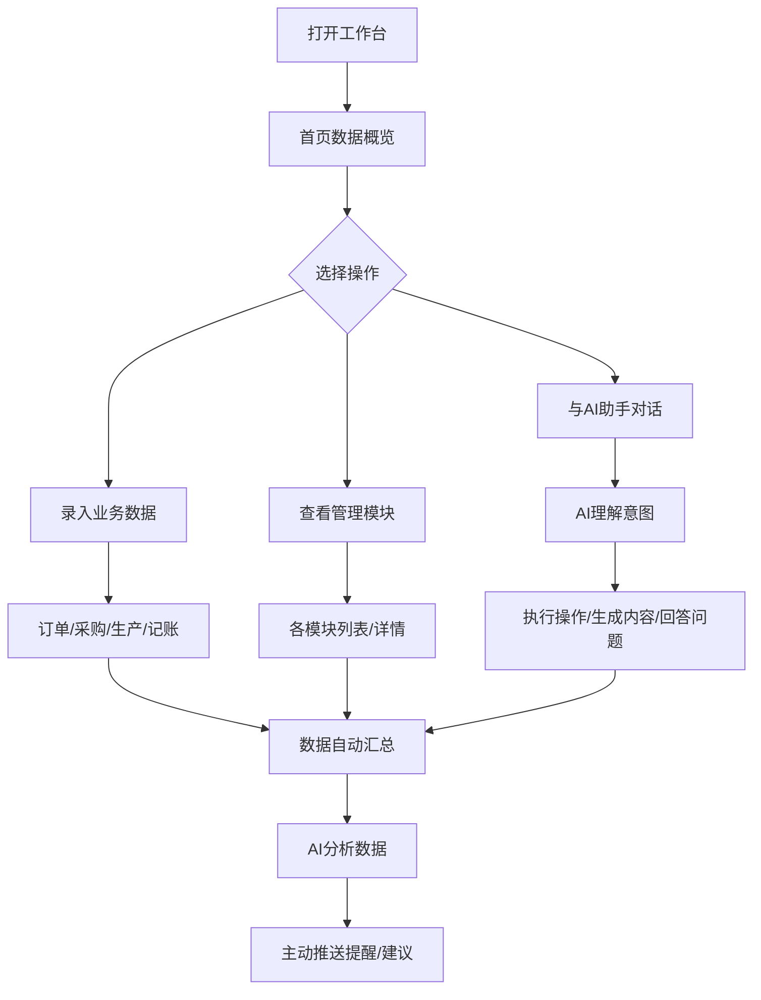

# 鱼丸厂AI工作台 - 产品需求文档

## 1. 产品概述
专为鱼丸制品小工厂老板打造的一站式AI智能工作台，整合采购、生产、销售、配送、记账、内容创作等全流程业务管理，通过AI大模型实现智能提醒、数据分析、内容生成、订单处理等自动化能力，帮助个体经营者减负增效。
- 目标用户：拥有小作坊生产许可证的鱼丸制品个体经营者
- 核心价值：将每日重复性工作集中管理，AI辅助决策，实现一人高效运营全链路

## 2. 核心功能

### 2.1 用户角色
| 角色 | 注册方式 | 核心权限 |
|------|----------|----------|
| 老板 | 本地使用/手机号登录 | 全部功能：数据管理、AI助手、系统设置 |

### 2.2 功能模块
1. **工作台首页**：数据概览仪表盘、今日待办、AI智能提醒、快捷操作
2. **订单管理**：订单列表、订单状态跟踪、客户信息、AI订单识别
3. **采购管理**：原材料采购记录、供应商管理、库存预警、AI采购建议
4. **生产管理**：生产计划、批次记录、产量统计、生产成本核算
5. **配送快递**：配送列表、快递跟踪、发货状态、签收提醒
6. **财务管理**：收支流水、利润统计、应收应付、AI自动记账
7. **内容创作**：视频选题库、脚本生成、发布记录、数据分析
8. **客户管理**：客户档案、购买记录、客户标签、AI客户维护提醒
9. **AI助手中心**：智能对话、文案生成、数据分析问答、语音输入
10. **数据看板**：经营数据可视化、趋势分析、AI经营建议

### 2.3 页面详情
| 页面名称 | 模块名称 | 功能描述 |
|----------|----------|----------|
| 工作台首页 | 数据概览卡片 | 今日订单数、待发货数、今日营收、待采购提醒 |
| 工作台首页 | AI智能助手 | 悬浮AI入口，支持快速提问和指令 |
| 工作台首页 | 今日待办 | 按优先级展示待处理事项，可勾选完成 |
| 工作台首页 | 快捷操作区 | 常用功能一键入口：记订单、记采购、发快递等 |
| 订单管理 | 订单卡片列表 | 卡片式展示订单，包含客户、产品、金额、状态 |
| 订单管理 | 筛选标签 | 按状态、时间、产品类型筛选订单 |
| 订单管理 | AI录入 | 支持语音/截图/文字描述，AI自动识别生成订单 |
| 采购管理 | 采购记录列表 | 采购时间、材料、数量、单价、供应商 |
| 采购管理 | 库存预警 | 低于安全库存自动提醒补货 |
| 采购管理 | AI采购建议 | 根据历史销量和订单预测采购量 |
| 生产管理 | 生产日历 | 日历视图展示每日生产计划 |
| 生产管理 | 批次卡片 | 展示每批次产品、产量、良品率 |
| 配送快递 | 快递列表 | 快递单号、收件人、状态自动跟踪 |
| 配送快递 | 物流轨迹 | 实时展示物流状态，签收自动提醒 |
| 财务管理 | 收支流水 | 按时间线展示每笔收支，支持分类统计 |
| 财务管理 | 利润图表 | 日/周/月利润趋势可视化 |
| 财务管理 | AI记账 | 语音/截图自动识别记账 |
| 内容创作 | 选题卡片库 | 卡片式展示视频选题、脚本、数据 |
| 内容创作 | AI脚本生成 | 输入主题自动生成口播脚本和标题 |
| 内容创作 | 发布日历 | 排期提醒和发布记录 |
| 客户管理 | 客户卡片 | 客户基本信息、购买历史、标签 |
| 客户管理 | AI回访提醒 | 久未下单客户自动提醒跟进 |
| AI助手中心 | 对话界面 | 类ChatGPT对话界面，支持各类经营问题 |
| AI助手中心 | 快捷指令 | 常用指令一键触发：写文案、算利润、想选题等 |
| 数据看板 | 可视化图表 | 销量趋势、产品占比、客户分布等图表 |
| 数据看板 | AI经营报告 | 定期生成经营分析报告和建议 |

## 3. 核心流程
用户打开工作台后首先看到首页概览，快速了解今日经营状况。通过左侧导航进入各功能模块进行业务操作，各模块产生的数据自动汇总分析，AI助手主动提供智能建议和提醒。日常操作可通过AI对话快速完成，减少手动录入。

## 4. 用户界面设计

### 4.1 设计风格
- **主色调**：温暖橙红色系（#E85D3C 鱼丸红）为主色，搭配米白色（#FDF8F3）背景，体现食品行业的温暖、食欲感和手工品质
- **辅助色**：清新绿色（#5B8C5A）表示成功/确认，暖黄色（#F5A623）表示提醒/警告
- **按钮风格**：圆角胶囊按钮，主按钮填充橙色，次按钮浅色描边， hover 有轻微上浮阴影效果
- **字体选择**：中文使用思源黑体/Noto Sans SC，数字使用等宽字体，标题加粗，正文清晰易读
- **布局风格**：左侧固定导航栏 + 顶部标签栏 + 主内容区卡片式布局，参考截图的精致工作台风格，层次分明
- **图标风格**：使用Lucide线性图标，统一2px描边，圆润风格
- **整体质感**：温暖纸张质感背景，卡片轻微投影，柔和圆角，营造舒适不刺眼的长时间使用体验

### 4.2 页面设计概览
| 页面名称 | 模块名称 | UI元素 |
|----------|----------|--------|
| 全局布局 | 左侧导航栏 | 宽度240px，品牌Logo区，导航菜单带图标，底部同步状态，hover高亮，当前项橙色背景 |
| 全局布局 | 顶部标签栏 | 高度48px，标签式导航，数字角标，搜索框居中靠右，操作按钮 |
| 工作台首页 | 数据概览卡片 | 4个并排卡片，大号数字，小号标签，图标装饰，hover微动效 |
| 工作台首页 | 今日待办 | 左侧待办列表，checkbox勾选，优先级标记，AI建议条目 |
| 工作台首页 | AI悬浮按钮 | 右下角圆形橙色按钮，点击展开对话面板 |
| 列表页面 | 筛选标签栏 | 圆角标签按钮组，选中态橙色填充，可滚动 |
| 列表页面 | 内容卡片 | 白色圆角卡片，阴影柔和，封面图/图标，标题，数据指标，标签，操作按钮 |
| 列表页面 | 视图切换 | 卡片视图/表格视图切换按钮 |
| AI对话 | 对话面板 | 右侧滑出/居中弹窗，消息气泡，橙色为AI，浅色为用户，输入框带语音按钮 |
| 表单录入 | 弹窗表单 | 半屏弹窗，大输入框，AI辅助填充按钮，保存/取消 |

### 4.3 响应式设计
- 桌面端优先设计，最小宽度1280px
- 平板端自适应（768px-1279px）：左侧导航可折叠为图标栏
- 移动端适配（<768px）：底部导航，顶部简化，卡片单列布局
- 所有按钮和可点击区域尺寸足够大，适合触屏操作

### 4.4 交互动效
- 页面切换：淡入淡出过渡
- 卡片hover：轻微上浮+阴影加深
- 按钮点击：缩放反馈
- AI消息：打字机效果逐字显示
- 数据更新：数字滚动动画
- 导航切换：当前项指示条平滑滑动
