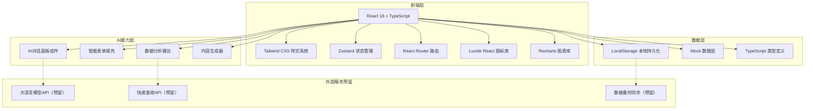

# 鱼丸厂AI工作台 - 技术架构文档

## 1. 架构设计



## 2. 技术选型说明
- **前端框架**：React 18 + TypeScript
- **构建工具**：Vite（快速启动、热更新）
- **样式方案**：Tailwind CSS 3（原子化CSS，快速开发）
- **状态管理**：Zustand（轻量、简单易用）
- **路由管理**：React Router DOM v6
- **图标库**：Lucide React（统一线性图标风格）
- **图表库**：Recharts（React友好的图表库）
- **数据存储**：LocalStorage（本地持久化，无需后端即可使用）
- **Mock数据**：内置模拟数据，开箱即用
- **后端**：纯前端演示版本，预留API接入能力

## 3. 路由定义
| 路由路径 | 页面功能 |
|----------|----------|
| / | 工作台首页（仪表盘） |
| /orders | 订单管理 |
| /purchasing | 采购管理 |
| /production | 生产管理 |
| /delivery | 配送快递 |
| /finance | 财务管理 |
| /content | 内容创作 |
| /customers | 客户管理 |
| /ai-assistant | AI助手中心 |
| /dashboard | 数据看板 |

## 4. 核心数据结构定义

### 4.1 订单类型
```typescript
interface Order {
  id: string;
  orderNo: string;
  customerId: string;
  customerName: string;
  products: OrderProduct[];
  totalAmount: number;
  status: 'pending' | 'confirmed' | 'producing' | 'shipping' | 'delivered' | 'cancelled';
  orderDate: string;
  deliveryDate?: string;
  address?: string;
  phone?: string;
  remark?: string;
  source: 'wechat' | 'phone' | 'offline' | 'other';
}
```

### 4.2 采购类型
```typescript
interface Purchase {
  id: string;
  materialName: string;
  quantity: number;
  unit: string;
  unitPrice: number;
  totalPrice: number;
  supplierId: string;
  supplierName: string;
  purchaseDate: string;
  status: 'planned' | 'purchased' | 'received';
  remark?: string;
}
```

### 4.3 客户类型
```typescript
interface Customer {
  id: string;
  name: string;
  phone: string;
  address?: string;
  tags: string[];
  totalOrders: number;
  totalAmount: number;
  lastOrderDate?: string;
  remark?: string;
}
```

### 4.4 内容类型
```typescript
interface Content {
  id: string;
  title: string;
  topic: string;
  script?: string;
  platform: 'douyin' | 'xiaohongshu' | 'shipinhao' | 'other';
  status: 'idea' | 'scripting' | 'filming' | 'editing' | 'published';
  publishDate?: string;
  views?: number;
  likes?: number;
  comments?: number;
}
```

### 4.5 财务记录类型
```typescript
interface FinanceRecord {
  id: string;
  type: 'income' | 'expense';
  category: string;
  amount: number;
  date: string;
  relatedId?: string;
  description: string;
  paymentMethod: 'cash' | 'wechat' | 'alipay' | 'bank';
}
```

## 5. 项目目录结构
```
/workspace
├── src/
│   ├── components/          # 可复用组件
│   │   ├── layout/         # 布局组件
│   │   │   ├── Sidebar.tsx
│   │   │   ├── TopBar.tsx
│   │   │   └── Layout.tsx
│   │   ├── ui/             # 基础UI组件
│   │   │   ├── Card.tsx
│   │   │   ├── Button.tsx
│   │   │   ├── Tag.tsx
│   │   │   └── StatCard.tsx
│   │   ├── business/       # 业务组件
│   │   │   ├── OrderCard.tsx
│   │   │   ├── ContentCard.tsx
│   │   │   ├── AIChatPanel.tsx
│   │   │   └── TodoList.tsx
│   │   └── charts/         # 图表组件
│   ├── pages/              # 页面组件
│   │   ├── Dashboard.tsx
│   │   ├── Orders.tsx
│   │   ├── Purchasing.tsx
│   │   ├── Production.tsx
│   │   ├── Delivery.tsx
│   │   ├── Finance.tsx
│   │   ├── Content.tsx
│   │   ├── Customers.tsx
│   │   ├── AIAssistant.tsx
│   │   └── DataBoard.tsx
│   ├── store/              # Zustand状态管理
│   │   ├── useOrderStore.ts
│   │   ├── useCustomerStore.ts
│   │   └── useUIStore.ts
│   ├── data/               # Mock数据
│   │   └── mockData.ts
│   ├── types/              # TypeScript类型定义
│   │   └── index.ts
│   ├── utils/              # 工具函数
│   ├── App.tsx
│   ├── main.tsx
│   └── index.css
├── .trae/documents/        # 项目文档
├── package.json
├── tsconfig.json
├── vite.config.ts
├── tailwind.config.js
└── postcss.config.js
```

## 6. AI功能实现策略（前端演示版）
1. **AI对话面板**：实现完整UI交互，内置预设回复和演示效果，预留API接入接口
2. **智能提醒**：基于内置规则逻辑演示（如库存预警、客户回访提醒）
3. **内容生成**：内置文案模板库，根据输入主题拼接生成示例内容
4. **数据建议**：基于Mock数据的简单统计分析，生成经营建议文本
5. **未来扩展**：所有AI相关功能封装独立模块，后续可无缝接入真实大模型API
